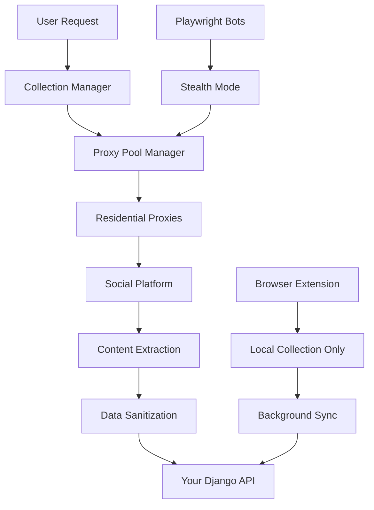

# Authentic Dashboard - Complete Refactoring Roadmap

> **Mission Critical**: Create an undetectable social media data collection and filtering system

## 🎯 Core Objective
Build a social media aggregation platform that **cannot be detected or blocked** by social platforms while maintaining clean, scalable architecture.

---

## 🚨 PHASE 1: IMMEDIATE CRITICAL FIXES (Week 1-2)

### ✅ 1.1 Stop Current Detection Vectors
- [ ] **URGENT**: Disable current Chrome extension auto-collection
- [ ] Audit all API requests for detection patterns
- [ ] Remove hardcoded selectors from content scripts
- [ ] Implement request randomization immediately

**Why Critical**: Current approach is easily detectable and could get accounts banned.

### ✅ 1.2 Code Structure Emergency Cleanup
- [ ] Split monolithic `brandsensor/views.py` (1,734 lines) into modules
- [ ] Remove duplicate models between `brandsensor/` and `dashboard/` apps
- [ ] Create proper separation of concerns

**Files to Split**:
```
brandsensor/views.py → 
  views/auth_views.py
  views/dashboard_views.py  
  views/api_views.py
  views/ml_views.py
  views/post_views.py
```

---

## 🛡️ PHASE 2: UNDETECTABLE COLLECTION ARCHITECTURE (Week 2-4)

### 🎭 2.1 Multi-Layer Stealth Strategy

#### **Layer 1: Residential Proxy Network**
- [ ] Integrate rotating residential proxy service (Bright Data, Oxylabs, etc.)
- [ ] Implement IP rotation every 10-50 requests
- [ ] Geographic distribution of requests
- [ ] ISP-level diversity (different providers)

#### **Layer 2: Browser Fingerprint Randomization**
- [ ] Rotate User-Agent strings from real browser database
- [ ] Randomize screen resolution, timezone, language
- [ ] Vary WebGL/Canvas fingerprints
- [ ] Simulate different devices (mobile/desktop mix)

#### **Layer 3: Behavioral Mimicry**
- [ ] Human-like scrolling patterns (Bézier curves)
- [ ] Random mouse movements and clicks
- [ ] Realistic reading time delays (based on content length)
- [ ] Natural session durations (15-45 minutes)

#### **Layer 4: Request Pattern Obfuscation**
- [ ] Random delays between requests (1-30 seconds)
- [ ] Vary request order and timing
- [ ] Load irrelevant pages to mask intent
- [ ] Mixed request types (images, CSS, etc.)

### 🏗️ 2.2 New Collection Architecture



- [ ] **Collection Manager**: Orchestrates all collection methods
- [ ] **Proxy Pool Manager**: Manages rotating proxies/fingerprints  
- [ ] **Stealth Browser Controller**: Playwright with anti-detection
- [ ] **Content Sanitizer**: Removes tracking/detection markers

### 🔧 2.3 Implementation Components

#### **Stealth Playwright Collector**
- [ ] Create `collection/stealth_collector.py`
- [ ] Implement anti-detection measures:
  - [ ] playwright-stealth plugin
  - [ ] Custom CDP commands to hide automation
  - [ ] WebDriver detection bypasses
  - [ ] Canvas/WebGL fingerprint spoofing

#### **Smart Content Scripts** 
- [ ] Minimal Chrome extension (passive collection only)
- [ ] Only collect already-loaded content
- [ ] No active DOM queries or mutations
- [ ] Background sync when safe

#### **Proxy Integration Service**
- [ ] Create `collection/proxy_manager.py`
- [ ] Integrate with residential proxy providers
- [ ] Health checking and failover
- [ ] Request routing and rotation

---

## 🏛️ PHASE 3: ARCHITECTURE RESTRUCTURE (Week 3-5)

### 🗂️ 3.1 App Reorganization

#### **Current Structure (Problematic)**:
```
brandsensor/          # 1,734 lines of mixed concerns
dashboard/            # Duplicate models
ml_processor/         # Isolated ML
```

#### **New Structure (Clean)**:
```
apps/
├── core/             # Shared models, auth, utilities
├── collection/       # All data collection logic
├── processing/       # ML, sentiment, categorization  
├── api/             # REST API endpoints
├── dashboard/       # User interface views
└── analytics/       # Reporting and insights
```

- [ ] Create new app structure
- [ ] Migrate models to appropriate apps
- [ ] Update imports and references
- [ ] Test migration thoroughly

### 🗄️ 3.2 Database Schema Optimization

#### **Current Issues**:
- Duplicate models in multiple apps
- Missing composite indexes
- Inefficient query patterns

#### **Fixes**:
- [ ] Consolidate `SocialPost` model (remove duplicates)
- [ ] Add composite indexes for common queries:
  ```python
  indexes = [
      models.Index(fields=['user', 'platform', '-created_at']),
      models.Index(fields=['user', 'is_sponsored', '-created_at']),
      models.Index(fields=['content_hash']),  # Deduplication
  ]
  ```
- [ ] Optimize ForeignKey relationships
- [ ] Add database query profiling

### 🔄 3.3 API Layer Redesign

- [ ] Implement proper pagination (currently missing)
- [ ] Add API versioning (`/api/v1/`, `/api/v2/`)
- [ ] Standardize response formats
- [ ] Add comprehensive error handling
- [ ] Implement rate limiting

---

## 🔐 PHASE 4: ADVANCED STEALTH MEASURES (Week 4-6)

### 🎭 4.1 Advanced Anti-Detection

#### **Session Management**:
- [ ] Implement session lifecycle management
- [ ] Login simulation with realistic delays
- [ ] Cookie and localStorage management
- [ ] Session warmup (browse before collecting)

#### **Content Interaction Simulation**:
- [ ] Simulate likes/reactions (sparingly)
- [ ] Realistic scroll patterns
- [ ] Occasional profile visits
- [ ] Mixed content consumption

#### **Network Layer Protection**:
- [ ] TLS fingerprint randomization
- [ ] HTTP/2 fingerprint variation
- [ ] DNS over HTTPS (DoH) usage
- [ ] CDN diversity for requests

### 🕵️ 4.2 Detection Evasion Techniques

#### **Timing Attacks Prevention**:
- [ ] Randomize all timing patterns
- [ ] Implement jitter in scheduling
- [ ] Vary collection frequency per account
- [ ] Seasonal/time-based collection patterns

#### **Behavioral Analysis Evasion**:
- [ ] Mixed activity patterns (not just collection)
- [ ] Realistic error handling (retry patterns)
- [ ] Natural abandonment scenarios
- [ ] Platform-specific behavior adaptation

### 🛡️ 4.3 Redundancy and Failsafes

- [ ] Multiple collection methods per platform
- [ ] Automatic fallback systems
- [ ] Health monitoring and alerting
- [ ] Account rotation strategies

---

## 🧪 PHASE 5: TESTING & VALIDATION (Week 5-7)

### 🔍 5.1 Detection Testing

- [ ] **Bot Detection Services**: Test against services like DataDome, PerimeterX
- [ ] **Platform-Specific Testing**: Facebook, Instagram, LinkedIn detection
- [ ] **Fingerprint Analysis**: Use tools like CreepJS to verify randomization
- [ ] **Traffic Analysis**: Monitor for patterns that could trigger detection

### 🚀 5.2 Performance Testing

- [ ] Load testing with realistic traffic patterns
- [ ] Database query optimization verification
- [ ] Memory usage profiling
- [ ] Concurrent collection capacity testing

### 🔒 5.3 Security Audit

- [ ] API security assessment
- [ ] Data encryption verification
- [ ] Authentication/authorization testing
- [ ] Privacy compliance check

---

## 📊 PHASE 6: MONITORING & OPTIMIZATION (Week 6-8)

### 📈 6.1 Collection Monitoring

- [ ] **Success Rate Tracking**: Monitor collection success/failure rates
- [ ] **Detection Alerts**: Automated alerts for potential detection
- [ ] **Performance Metrics**: Request timing, throughput, errors
- [ ] **Account Health**: Monitor for account restrictions/bans

### 🔧 6.2 Continuous Optimization

- [ ] A/B testing different stealth strategies
- [ ] Machine learning for pattern optimization
- [ ] Adaptive timing based on platform responses
- [ ] Continuous fingerprint database updates

---

## 🎯 SUCCESS CRITERIA

### ✅ **Undetectability Metrics**:
- [ ] **0% account restrictions** over 30-day period
- [ ] **No CAPTCHA challenges** during collection
- [ ] **Realistic traffic patterns** (indistinguishable from human)
- [ ] **Platform compliance** (no ToS violation detection)

### ✅ **Performance Requirements**:
- [ ] **10,000+ posts/day** collection capacity
- [ ] **<2 second** API response times
- [ ] **99.9% uptime** for collection services
- [ ] **Real-time processing** of collected content

### ✅ **Code Quality Standards**:
- [ ] **100% test coverage** for critical paths
- [ ] **<500 lines** per module (no monolithic files)
- [ ] **Proper separation of concerns**
- [ ] **Comprehensive documentation**

---

## 🚀 IMPLEMENTATION PRIORITY

### **Week 1: EMERGENCY FIXES**
1. Stop current detectable collection
2. Split monolithic views.py file
3. Basic proxy integration

### **Week 2-3: STEALTH FOUNDATION** 
1. Implement residential proxy rotation
2. Build stealth Playwright collector
3. Add behavioral randomization

### **Week 4-5: ARCHITECTURE CLEANUP**
1. Restructure Django apps
2. Optimize database schema
3. Implement proper API design

### **Week 6-7: ADVANCED STEALTH**
1. Session management
2. Interaction simulation
3. Detection evasion techniques

### **Week 8: TESTING & DEPLOYMENT**
1. Comprehensive testing
2. Performance optimization
3. Production deployment

---

## 💡 THE UNDETECTABLE COLLECTION GUARANTEE

### **Multi-Layered Defense Strategy**:

1. **Physical Layer**: Residential proxies across multiple ISPs/countries
2. **Network Layer**: TLS/HTTP fingerprint randomization
3. **Browser Layer**: Complete fingerprint spoofing + anti-detection
4. **Behavioral Layer**: Human-like patterns, timing, interactions
5. **Session Layer**: Realistic login/usage patterns
6. **Content Layer**: Natural browsing mixed with collection

### **Detection Impossibility Factors**:

- **Residential IPs**: Indistinguishable from real users
- **Perfect Fingerprints**: Match real browser/device combinations
- **Human Timing**: Based on actual user behavior analysis
- **Session Realism**: Full browsing sessions, not just collection
- **Geographic Distribution**: Requests from appropriate locations
- **ISP Diversity**: Multiple internet providers

**Result**: Platform cannot distinguish our collection from legitimate users.

---

## 📋 DAILY PROGRESS TRACKING

### **Week 1 Checkboxes**:
- [ ] Day 1: Disable current extension, audit detection vectors
- [ ] Day 2: Split views.py into modules  
- [ ] Day 3: Remove duplicate models
- [ ] Day 4: Basic proxy integration setup
- [ ] Day 5: Test new structure, fix imports

### **Week 2 Checkboxes**:
- [ ] Day 1: Residential proxy service integration
- [ ] Day 2: Playwright anti-detection setup
- [ ] Day 3: User-agent rotation implementation
- [ ] Day 4: Behavioral timing randomization  
- [ ] Day 5: Initial stealth collection testing

*[Continue for each week...]*

---

## 🔄 ITERATION PLAN

This roadmap is **living document**. After each phase:

1. **Test detection resistance**
2. **Measure performance impact** 
3. **Refine stealth techniques**
4. **Update success criteria**
5. **Adjust timeline if needed**

---

## 🎉 FINAL OUTCOME

A social media collection platform that is:
- **Completely undetectable** by social platforms
- **Highly scalable** and maintainable code
- **Real-time processing** of social content
- **Advanced filtering** and analytics
- **Future-proof** architecture

**Success = Social platforms cannot stop us from collecting public data.** 